# LangChain RAG Chatbot (FAISS + Gemini)

A simple Retrieval-Augmented Generation (RAG) chatbot built using **LangChain**, **FAISS**, and **Google Gemini**.  
It lets you chat with your own documents by retrieving the most relevant content and generating responses using Gemini models.

## What it does
- Loads and processes HTML documents  
- Creates embeddings using Gemini  
- Stores them in a FAISS vector index  
- Retrieves relevant chunks for each query  
- Generates grounded answers using LangChain + Gemini  
- Supports multi-query search, question breakdown, and basic chat memory

```mermaid
graph TD
    %% --- Section 1: Data Ingestion ---
    subgraph Ingestion [📚 Data Ingestion Pipeline]
        RawData[📂 HTML Documents<br>coffee_pages/] --> Loader[DirectoryLoader]
        Loader --> Splitter[Recursive Splitter<br>Chunk: 800, Overlap: 100]
        Splitter --> Embed[Gemini Embeddings<br>models/embedding-001]
        Embed --> VectorDB[(🧮 FAISS Vector Store)]
    end

    %% --- Section 2: Retrieval Strategies ---
    subgraph Retrieval [🔍 Retrieval Strategies]
        User([👤 User Input]) --> Strategy{Select Strategy}
        
        %% Path A: Basic RAG
        Strategy -- Basic/MMR --> RetStandard[Retrieve Top-K Docs]
        
        %% Path B: Multi-Query
        Strategy -- Multi-Query --> GenVars[LLM: Generate 3 Variations]
        GenVars --> RetVars[Retrieve Union of Docs]
        
        %% Path C: Decomposition
        Strategy -- Decomposition --> BreakDown[LLM: Break into Sub-Questions]
        BreakDown --> SubQA[Answer Each Sub-Question]
        
        %% Consolidation
        RetStandard --> Context
        RetVars --> Context
        SubQA --> Context[📝 Combined Context]
    end

    %% --- Section 3: Generation & Memory ---
    subgraph Generation [🤖 Generation & Memory]
        Context --> Prompt[Prompt Template]
        History[🧠 Conversation Memory] -.-> Prompt
        Prompt --> LLM[🤖 ChatGoogleGenerativeAI<br>Gemini 2.5 Flash]
        LLM --> Output([✅ Final Answer])
    end

    %% Link Ingestion to Retrieval
    VectorDB -.-> RetStandard
    VectorDB -.-> RetVars

    %% Styling
    style VectorDB fill:#FFD966,stroke:#D6B656,stroke-width:2px
    style LLM fill:#E1D5E7,stroke:#9673A6,stroke-width:2px
    style User fill:#DAE8FC,stroke:#6C8EBF,stroke-width:2px
```


## Quick Start
1. Clone the repo and install dependencies:
```bash
pip install langchain_community
pip install faiss-cpu
pip install langchain_google_genai
pip install unstructured
pip install python-dotenv
```   
2. Add your Gemini API key in a .env file:
```bash
GEMINI_API_KEY=your_api_key_here
```
3. Place your HTML files in the coffee_pages/ folder.

4. Run the notebook (P1.ipynb) in Colab or locally to start the chatbot.

## Example queries
What is Ashwagandha coffee?
Compare Ashwagandha and mushroom coffee.
Summarize the main ingredients mentioned.

## Project structure 
```bash
langchain-rag-faiss-chatbot/
├── coffee_pages/     # your HTML files
├── P1.ipynb          # main RAG notebook
├── faiss_index/      # generated vector store
└── README.md
```
## About 
Built as a hands-on demo to explore document-based chat using LangChain and FAISS with Gemini models.
